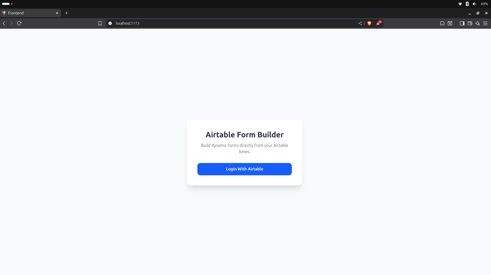

```markdown
# Airtable-Connected Dynamic Form Builder 🧩

*A Full-Stack Dynamic Form Creation Platform with Airtable OAuth Integration*

Airtable-Connected Dynamic Form Builder is a **full-stack MERN application** that allows users to authenticate with Airtable, generate dynamic forms using their Airtable bases/tables, apply **conditional logic**, share forms publicly, and automatically sync responses back to both **Airtable** and **MongoDB**.

Designed for teams, creators, and automation lovers who want to build forms powered directly by their Airtable schema — no code required.

---


---

## 🔗 Live Demo
 
**Live App:** https://airtable-connected-dynamic-form-bui-iota.vercel.app

---


## 🚀 Features

### 👤 User Features

- Sign in securely via **Airtable OAuth**.
- View all Airtable **bases, tables, and fields** inside the app.
- Create fully dynamic forms mapped to Airtable tables.
- Apply **conditional logic** to show/hide fields (supports multiple conditions).
- Share forms publicly using a generated link.
- Fill forms without needing an account (public access).

### 🗂️ Form Features

- Dynamic rendering based on Airtable schema.
- Supports text, number, email, attachments, and more.
- Real-time conditional visibility of fields.
- Auto-save responses to **Airtable records** and **MongoDB**.

### 🔐 Authentication & Security

- Secure OAuth with Airtable (access/refresh tokens).
- Backend-protected routes for retrieving bases and tables.
- CORS + Cookie-based session handling.
- Form access restrictions where required.

---

## 🛠️ Tech Stack

### 🌐 Frontend

- **React + Vite**
- **Tailwind CSS**
- **Axios** for API calls
- React Hooks + clean component structure

### 🖥️ Backend

- **Node.js + Express.js**
- **MongoDB + Mongoose**
- **Airtable API + OAuth Flow**

### Additional Libraries

- **jsonwebtoken (JWT)** → Secure authentication  
- **cookie-parser** → Cookies for token handling  
- **dotenv** → Environment config  
- **cors** → API security  
- **cron / background tasks** (optional for syncing)

---

## 📂 Project Structure

```

Airtable-Connected-Dynamic-Form-Builder/
├── backend/
│   ├── src/
│   │   ├── config/
│   │   │   ├── airtableClient.js      # Airtable API + OAuth helpers
│   │   │   └── db.js                  # MongoDB connection
│   │   ├── middleware/
│   │   │   └── auth.js                # Auth protection middleware
│   │   ├── models/
│   │   │   ├── user.model.js
│   │   │   ├── form.model.js
│   │   │   └── response.model.js
│   │   ├── routes/
│   │   │   ├── airtableRoutes.js      # Bases, tables, fields API
│   │   │   ├── authRoutes.js          # Airtable OAuth
│   │   │   ├── formRoutes.js          # Form creation, metadata
│   │   │   ├── responseRoutes.js      # Public form response endpoint
│   │   │   └── webhookRoutes.js       # Optional Airtable webhook endpoints
│   │   └── index.js                   # Express server entry point
│   ├── .env                            # Backend environment variables
│   ├── package.json
│
├── frontend/
│   ├── public/
│   │   └── images/                     # README screenshots
│   ├── src/
│   │   ├── api/                        # Axios API wrappers
│   │   ├── components/                 # Reusable UI components
│   │   ├── hooks/                      # Custom hooks
│   │   ├── pages/                      # All views
│   │   │   ├── LoginPage.jsx
│   │   │   ├── DashboardPage.jsx
│   │   │   ├── FormBuilderPage.jsx
│   │   │   ├── FormViewerPage.jsx
│   │   │   ├── ResponsePage.jsx
│   │   │   └── ThankYouPage.jsx
│   │   ├── utils/
│   │   ├── App.jsx
│   │   └── main.jsx
│   ├── .env                             # Frontend env variables
│   ├── package.json
│   └── vite.config.js
│
└── README.md

```

---

## 🔧 Environment Variables

### 🟦 backend/.env

```

PORT=
MONGO_URI=

AIRTABLE_CLIENT_ID=
AIRTABLE_CLIENT_SECRET=
AIRTABLE_REDIRECT_URI=

JWT_SECRET=
SESSION_SECRET=
FRONTEND_URL=

```

### 🟩 frontend/.env

```

VITE_API_URL=
VITE_AIRTABLE_CLIENT_ID=
VITE_AIRTABLE_REDIRECT_URL=

````

*All left blank intentionally — users configure their own values.*

---

## ⚙️ Installation & Setup

### 1️⃣ Clone the repository

```bash
git clone https://github.com/your-username/Airtable-Connected-Dynamic-Form-Builder.git
cd Airtable-Connected-Dynamic-Form-Builder
````

### 2️⃣ Install backend dependencies

```bash
cd backend
npm install
npm run dev
```

### 3️⃣ Install frontend dependencies

```bash
cd ../frontend
npm install
npm run dev
```

### 4️⃣ Add `.env` files

See environment variable section above.

---

## 🌐 Using ngrok for Local OAuth

Airtable requires a **public redirect URI** for OAuth.
Expose your backend:

```bash
ngrok http 4002
```

Use the generated HTTPS URL in:

```
AIRTABLE_REDIRECT_URI=
```

---

# 🧠 How the App Works (Flow Overview)

1. User enters the app → clicks **Sign in with Airtable**
2. Redirected to Airtable → OAuth token exchange (access + refresh)
3. User returns to dashboard
4. App fetches:

   * all Airtable **bases**
   * tables within a base
   * fields of a selected table
5. User selects which fields to include
6. User configures **conditional logic** rules
7. System generates a **public form URL**
8. Respondents fill the form → data saved to:

   * Airtable
   * MongoDB
9. User views all responses inside Airtable and dashboard

---

# 📸 Screenshots

> Add your screenshots inside:
> `./frontend/public/images/`

Example usage:

```markdown



```

---

# 🧪 API Routes (Quick Overview)

### 🔐 Auth

* `GET /auth/login` — Begin Airtable OAuth
* `GET /auth/callback` — OAuth callback
* `GET /auth/me` — User profile

### 📦 Airtable Integration

* `GET /airtable/bases`
* `GET /airtable/tables/:baseId`
* `GET /airtable/fields/:baseId/:tableId`

### 📝 Forms

* `POST /forms` — create form definition
* `GET /forms` — list all forms
* `GET /forms/:id` — get form metadata

### 📥 Responses

* `POST /forms/:id/submit` — submit response

---

# 🤝 Contribution

Pull requests are welcome!
If you want to add features like analytics, templates, or multi-step forms — feel free to open an issue first.

---

# 📜 License

MIT License

---